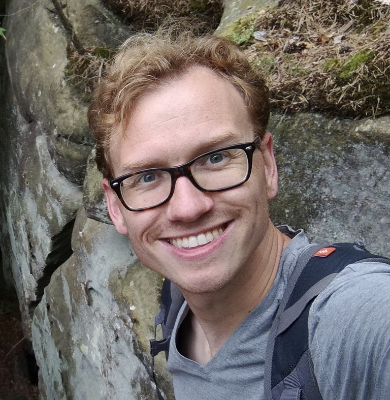
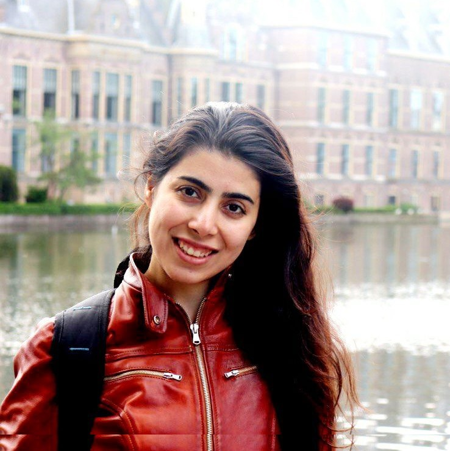

## About
The IvI P(h)D council was established in early 2020 as an initiative proposed by the PhD and postdoc community of IvI. Our task is to care for the interest of PhD candidates and postdocs of the [Informatics Institute](https://ivi.uva.nl) at the [University of Amsterdam](https://www.uva.nl).

The mission of the IvI P(h)D council is twofold: (1) create a sense of community among IvI PhDs and postdocs, and (2) provide a voice and a platform for them to address issues and relevant topics.

## Members

Jori Hoencamp is a PhD candidate at the [Computational Science Lab](https://ivi.uva.nl/content/research-groups/computational-science/computational-science.html). His research evolves around computational finance and focuses on models for FX and interest rates. On the council he looks forward to organising social activities for PhDs by PhDs.

Shaojie Jiang is a 4th year PhD candidate in [Information Retrieval Lab](https://ilps.science.uva.nl). His research topic is Open-domain Dialogue Systems (check his [personal homepage](https://shaojiejiang.github.io/) for more details). He is also very interested in photography.

Sara Shakeri is a PhD candidate in the [Systems and Networking Lab](https://ivi.fnwi.uva.nl/sne/people/mns-people/).

Shuo Chen is a PhD candidate at [Video & Image Sense Lab](https://ivi.fnwi.uva.nl/vislab/) under the supervision of Prof. Cees Snoek and dr. Pascal Mettes. For more details see his [academic homepage](https://staff.fnwi.uva.nl/s.chen3/).

David Stap is a PhD candidate in the Language Technology Lab, under the supervision of dr. Christof Monz. He is working on multilingual machine translation and aims to improve translation quality for low-resource languages. See [his website](https://davidstap.github.io) for more details.

## Join us
The IvI P(h)D Council has recently been started, and we are recruiting. We seek to improve the experience of PhDs and postdocs during their time at IvI in a broad variety of ways. These includ  e:
- Planning fun activities to bring the P(h)D community together, so that you can know your colleagues and their works better.
- General support on any issues P(h)Ds are faced with.

## Events
Coming soon.

## Contact
- E-mail (soon)
- Twitter (soon)
